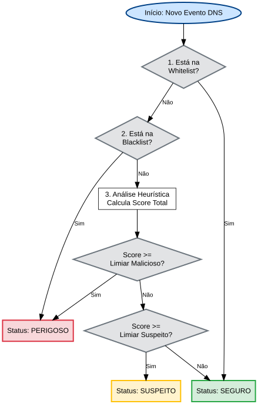

# PhishGuard — Monitor de Rede Doméstica (MVP)

O **PhishGuard** é um protótipo de sistema de monitoramento de rede doméstica desenvolvido como Trabalho de Conclusão de Curso (TCC) para o curso de Análise e Desenvolvimento de Sistemas na **UNISINOS (2026)**. 

O objetivo do sistema é capturar requisições DNS em tempo real, analisar os domínios consultados por meio de heurísticas explicáveis e listas de reputação, e alertar o usuário sobre potenciais tentativas de phishing diretamente em um painel gráfico interativo.

---

## 📸 Fluxograma de Decisão do Sistema

A imagem abaixo ilustra o fluxo de processamento das requisições DNS capturadas pela placa de rede até a sua classificação no painel visual:



---

## 🚀 Funcionalidades Principais

* **Captura de Pacotes em Tempo Real:** Monitoramento passivo do tráfego DNS da placa de rede local (Porta 53) suportando tanto transporte **UDP** quanto **TCP** (tratando de forma personalizada os 2 bytes de cabeçalho da RFC 1035 no TCP).
* **Arquitetura Assíncrona (Producer-Consumer):** Uma thread dedicada realiza a captura contínua e insere os eventos em uma fila thread-safe (`queue.Queue`), enquanto a interface gráfica consome e renderiza os dados periodicamente, evitando travamentos (*freezes*).
* **Classificação de Ameaças Transparente:**
  * **Whitelist/Blacklist:** Cruzamento com bases de reputação locais e atualizáveis.
  * **Análise Heurística por Pontuação:** Classificação inteligente com base em TLDs suspeitos, palavras-chave comuns de phishing, distância de Levenshtein (typosquatting contra domínios populares), profundidade de subdomínios, e caracteres homográficos (IDN).
* **Interface Gráfica Premium:** Dashboard moderno desenvolvido em **CustomTkinter** com estatísticas de tráfego, nível de alerta (Seguro 🟢, Suspeito 🟡, Perigoso 🔴), detalhes de cada evento e exportação de relatórios em formato JSON.

---

## 🛠️ Tecnologias Utilizadas

* **Linguagem:** Python 3.10+
* **Interface Gráfica:** CustomTkinter
* **Captura de Rede:** Scapy & Npcap
* **Comunicação/Requisições:** Requests

---

## 📋 Pré-requisitos

Como a captura de tráfego é feita em nível de driver, são necessários os seguintes componentes:

1. **Npcap (Windows):** O Scapy depende do driver Npcap para ler os frames de rede diretamente no Windows. Baixe e instale em: [https://npcap.com/](https://npcap.com/) (certifique-se de marcar a opção de compatibilidade com WinPcap durante a instalação).
2. **Privilégios de Administrador:** A captura de pacotes na placa de rede exige execução com privilégios elevados. O PhishGuard solicitará elevação automaticamente caso não seja iniciado como Administrador.

---

## 🔧 Instalação e Execução

1. **Clone o repositório:**
   ```bash
   git clone https://github.com/seu-usuario/phishguard-mvp.git
   cd phishguard-mvp
   ```

2. **Crie e ative um ambiente virtual (recomendado):**
   ```bash
   python -m venv venv
   # No Windows:
   venv\Scripts\activate
   # No Linux/macOS:
   source venv/bin/activate
   ```

3. **Instale as dependências:**
   ```bash
   pip install -r requirements.txt
   ```

4. **Execute a aplicação (como Administrador no Windows):**
   ```bash
   python main.py
   ```

---

## 📁 Estrutura de Diretórios

O projeto segue um padrão modular com responsabilidades bem separadas:

```text
├── analyzer/              # Módulo de Classificação e Heurísticas
│   ├── blacklist.py       # Gerenciamento de listas de bloqueio/liberação
│   ├── classifier.py      # Orquestrador do cálculo do score e nível de risco
│   └── heuristics.py      # Implementação das heurísticas (Levenshtein, TLD, etc.)
├── data/                  # Base de dados local (arquivos de texto)
│   ├── blacklist_domains.txt
│   ├── whitelist_domains.txt
│   └── popular_domains.txt
├── docs/                  # Documentações adicionais do projeto
│   └── ARCHITECTURE.md    # Detalhamento arquitetural completo
├── gui/                   # Módulo de Interface Visual (CustomTkinter)
│   ├── app.py             # Janela principal e controle de loops de eventos
│   └── widgets.py         # Componentes personalizados da interface (tabelas, cards)
├── logs/                  # Diretório gerado automaticamente para arquivos .log
├── sniffer/               # Módulo de Captura e Processamento de Baixo Nível
│   └── capture.py         # Thread do Sniffer usando Scapy e filtros BPF
├── utils/                 # Scripts utilitários
│   └── blacklist_updater.py  # Atualizador automático da lista de reputação
├── config.py              # Centralização de configurações globais e limiares
├── main.py                # Ponto de entrada (valida admin/dependências e inicia a GUI)
├── models.py              # Definição das estruturas de dados e classes de domínio
└── requirements.txt       # Dependências de bibliotecas de terceiros
```

---

## 🔒 Limitações do Escopo do MVP (Importante para o TCC)

Para fins de justificativa teórica e limitações metodológicas no TCC, deve-se atentar a:
1. **Isolamento de Wi-Fi (Modo Promíscuo):** Por padrão em redes Wi-Fi domésticas, o adaptador de rede opera em *Managed Mode* e só recebe tráfego enviado especificamente para o seu próprio MAC Address. Para capturar tráfego de outros aparelhos na rede, é necessário suporte a *Monitor Mode* ou *Port Mirroring* no roteador.
2. **Criptografia DNS (DoH e DoT):** Navegadores modernos e sistemas configurados com *DNS over HTTPS* (DoH) ou *DNS over TLS* (DoT) encapsulam consultas DNS na porta 443 ou 853 de forma criptografada. O monitor passivo do PhishGuard na porta 53 (texto claro) não consegue inspecionar tais pacotes sem uma infraestrutura ativa (ex: atuando como Proxy/Sinkhole local).

---

## 👨‍🎓 Autor

* **Rodrigo Dalavia Fechner** — *Trabalho de Conclusão de Curso* — **Análise e Desenvolvimento de Sistemas (UNISINOS 2026)**.
>>>>>>> 9d86a11 (Primeira versao do MVP)
